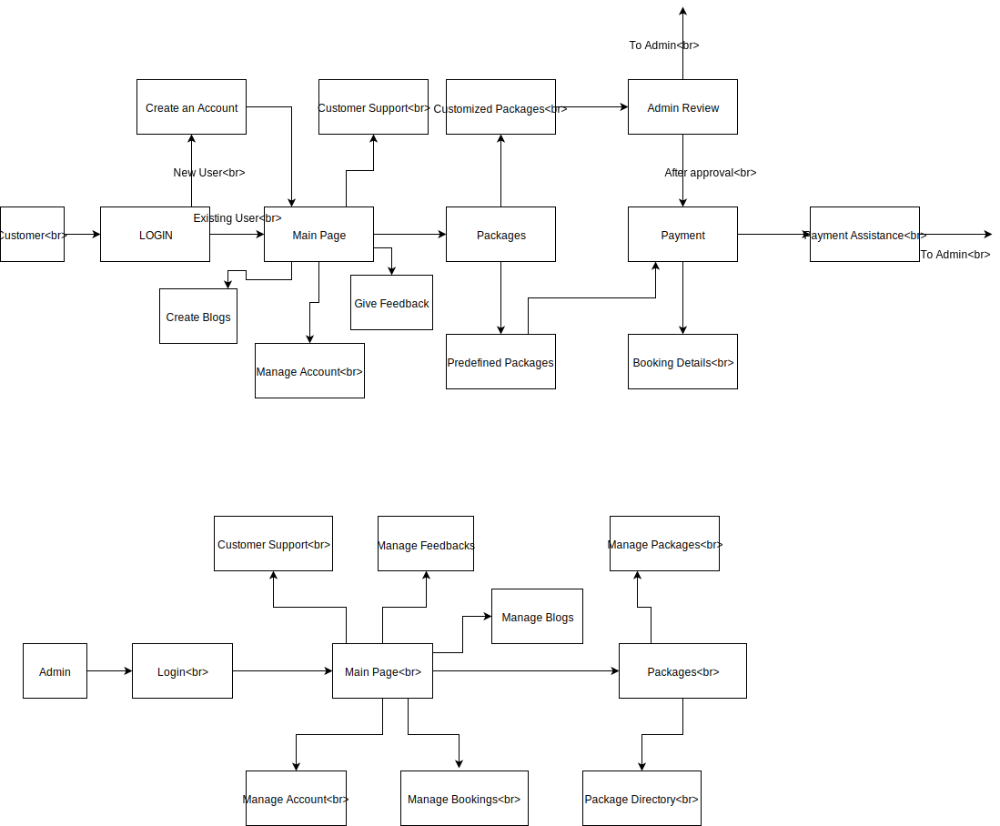

<h2>ADMIN </h2>
<table>
 <th>USER STORY</th>
 <th>ACCEPTANCE CRITERIA</th>
 <tr><td>Admin should be able to see the login portal to get access to the website control.</td>
   <td>Username field, password field and Login button should appear on the login screen.   
   Admin should be navigated to the admin home page after successful login.</td></tr>

<tr> <td> 
Admin should be able to see the ‘Manage About Us’ button. </td>
  <td> 
Admin should be able to create, read, update and delete the website details in the About us page.</td>
  </tr>

<tr> <td>
Admin should be able to see the ‘Manage Blogs’ button. </td>
  <td>
Admin should be able to see create blog button and approve blogs button.    
Admin should be able to see Blog title field, Blog content field and image uploader on clicking create blog button.   
Admin should be able to see Blog title field, Blog content field and image uploader on clicking create blog button.  
Admin should be able to see a table with the Blog title, blog content and images uploaded by customers for approval.  
Admin should be able to approve the blog after verification and it should appear on the website’s blog portal. </td> </tr>
  
  <tr> <td> 
Admin should be able to see the ‘Manage Feedbacks’ button.</td>
  <td>Admin should be able to see all the feedbacks provided by the customers in a table.   

Admin should be able to approve the feedback and approved feedbacks should appear on the feedbacks portal.  </td> </tr>
  
  <tr> <td>
Admin should be able to see the ‘Manage Enquiries’ button. </td>
  <td> 

Admin should be able to see all the enquiries sent by the customers in a table with a reply button for each.   

Admin should be able to respond to the enquiries through the reply button in a mail to the customer. </td> </tr>

<tr> <td> 
Admin should be able to see the ‘Manage Bookings’ button.</td>
  <td>
Admin should be able to see all the bookings done by the customers in a table.    

Admin should be able to cancel the booking and the customer should be sent a mail about cancellation of booking.</td> </tr>

<tr> <td>

Admin should be able to see the “Create Package’ button. </td>
  <td>

Admin should be able to see source, destination, price, itinerary and image uploader fields.   
Admin should be able to create a package after filling all the fields. </td> </tr>

<tr> <td> Admin should be able to see the ‘Manage Packages’ button.</td>
  <td> 

Admin should be able to see a list of existing packages in a table.   

Admin should be able to edit a package by clicking on edit button for each package. </td> </tr>
  
  
  <tr> <td>
Admin should be able to see the ‘Package Requests’’ button. </td>
  <td> 
Admin should be able to see all the package requests made by the customers in a table.   

Admin should be able to approve the package request by clicking on approve button for each request.</td> </tr>
  
</table>

